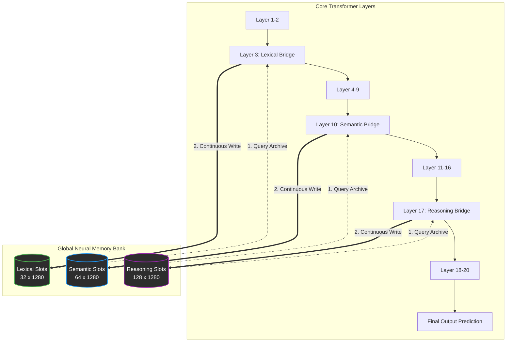

# Nexus V7: Continuous Associative Memory Architecture

## 1. The Philosophy: Hardware-Brain Symbiosis
Biological neurons in the human brain are incredibly efficient because their "software" (synaptic plasticity) is perfectly optimized for their "hardware" (electrochemical networks). There is no "central CPU" in the brain running `if/else` statements or `sort()` algorithms to decide which neurons to update. Instead, updates happen continuously, simultaneously, and proportionally based on resonance (Hebbian Learning: *"Neurons that fire together, wire together"*).

Similarly, modern GPU hardware (like the NVIDIA H100) is built to do one thing perfectly: **Dense Matrix Multiplications**. GPUs lose massive amounts of efficiency when forced to execute conditional branching, discrete sorting (Top-K), or sparse indexing (`gather/scatter`). 

By redesigning the **Global Neural Memory** from a discrete, routing-based MoE architecture into a **Continuous Associative Memory**, we have perfectly aligned the mathematical software of the neural network with the physical silicon of the GPU hardware.

---

## 2. Mathematical Formulation

Let the current context sequence at a specific layer be $\mathbf{X} \in \mathbb{R}^{B \times L \times D}$, and the current state of the global memory bank be $\mathbf{M}_{t-1} \in \mathbb{R}^{B \times S \times D}$, where $S$ is the fixed number of memory slots (e.g., 128).

### 2.1 The Read Path (Retrieval)
The sequence queries the memory to extract relevant facts. We use standard Cross-Attention.
1. **Retrieve:** $\mathbf{R} = \text{CrossAttention}(\text{Query}=\mathbf{X}, \text{Key}=\mathbf{M}_{t-1}, \text{Value}=\mathbf{M}_{t-1})$
2. **Read Gate:** $\mathbf{G}_{read} = \sigma(\mathbf{W}_{read} [\mathbf{X} \oplus \mathbf{R}] + \mathbf{b}_{read})$
3. **Inject:** $\mathbf{X}_{new} = \mathbf{G}_{read} \odot \mathbf{R} + (1 - \mathbf{G}_{read}) \odot \mathbf{X}$

### 2.2 The Write Path (Encoding)
Instead of forcing the sequence to compress into a single muddy vector, each memory slot actively *searches* the sequence for information relevant to its specialization.

1. **Extract Context:** The slots query the sequence.
   $\mathbf{U} = \text{CrossAttention}(\text{Query}=\mathbf{M}_{t-1} + \mathbf{E}_{init}, \text{Key}=\mathbf{X}, \text{Value}=\mathbf{X})$

2. **Affinity Gate:** Every slot evaluates how relevant the extracted information $\mathbf{U}$ is to its current identity $\mathbf{M}_{t-1}$.
   $\mathbf{A} = \sigma(\mathbf{W}_{affinity} [\mathbf{M}_{t-1} \oplus \mathbf{U}] + \mathbf{b}_{affinity})$

3. **Forget Gate:** Slots determine how much of their old state to retain (preventing amnesia).
   $\mathbf{F} = \text{clamp}(\sigma(\mathbf{W}_{forget} \mathbf{M}_{t-1} + \mathbf{b}_{forget}), F_{floor}, 0.95)$

4. **Continuous Update:** The memory state is updated continuously. Slots with high affinity strongly absorb the new context, while slots with low affinity ignore it.
   $\mathbf{C} = \mathbf{F} \odot \mathbf{M}_{t-1} + (1 - \mathbf{F}) \odot (\alpha \mathbf{U})$
   $\mathbf{M}_{t} = \text{LayerNorm}(\mathbf{A} \odot \mathbf{C} + (1 - \mathbf{A}) \odot \mathbf{M}_{t-1})$

---

## 3. Hardware Optimization (Why it screams on 8x H100s)

### Why the Old Top-K Routing Hogged VRAM and Slowed Down
The previous architecture used `torch.topk` and Gumbel noise to select the top slots to update. 
- **Gather/Scatter Penalty:** Applying discrete masks forces the GPU to jump around memory addresses, breaking the dense matrix multiplication pipeline.
- **VRAM Explosion:** Tracking the probability of every slot for the MoE Load Balancing Loss (`lb_loss`) required creating massive backward-pass tensors that flooded the VRAM.
- **Gradient Starvation:** Because only the "Top-K" slots were updated, gradients were zeroed out for the losing slots, causing dead neurons and wasted compute.

### Why Continuous Associative Memory is Lightning Fast
- **100% FlashAttention Compatible:** The memory module now relies entirely on PyTorch's `F.scaled_dot_product_attention`. On H100s, this automatically triggers **FlashAttention-2**, which computes the entire attention matrix inside the ultra-fast SRAM, bypassing the slow VRAM bottlenecks completely.
- **Pure Dense Math:** There are no `if/else` statements, no `argmax`, and no sorting. The entire forward pass is just a cascade of matrix multiplications and element-wise additions. The Tensor Cores stay fully saturated 100% of the time.
- **Zero MoE Overhead:** We deleted the load balancing loss. Memory balancing happens naturally via backpropagation through the continuous Affinity Gate.

---

## 4. Implementation Code

```python
# ── WRITE: Continuous Associative Encoding ──────────────────────────
# 1. Slots query the sequence for relevant information
mem_query = mem_norm + self.memory_init.unsqueeze(0)
mem_update = self.write_attn(mem_query, x_norm)

# 2. Affinity Gate: How relevant is the extracted sequence information to the slot?
affinity = self.affinity_gate(torch.cat([mem_norm, mem_update], dim=-1))

# 3. Forget Gate: How much of the old memory to retain
forget = self.gate(memory_state).clamp(self.retain_floor, 0.95)

# 4. Continuous update based on affinity resonance
candidate = forget * memory_state + (1 - forget) * (self.write_scale * mem_update)
new_memory = affinity * candidate + (1 - affinity) * memory_state

new_memory = self.mem_norm(new_memory)
```
```

---

## 5. Dynamic Model-Memory Interaction (Behavioral Flow)

How exactly does the core transformer model interact with this memory bank? Does it explicitly say *"Oh, I need to remember this name"*? 

The answer is **no explicit commands are needed**. The interaction is entirely emergent and driven by backpropagation.

### The Architecture Flow



### The "Consulting the Archive" Phase (READ)
When a sequence reaches Layer 3, 10, or 17, the core model pauses and looks at the memory bank. 
- If the current context is confusing or requires external knowledge (e.g., answering *"What is gravity?"*), the **Read Gate** opens wide (e.g., `0.95`). The memory slots pour their compressed knowledge into the residual stream, instantly making the model "smarter" for the remaining layers.
- If the model is just doing basic grammar completion (e.g., predicting the word *"the"*), the Read Gate closes (e.g., `0.05`), saving the model from being distracted by deep factual knowledge.

### The "Taking Notes" Phase (WRITE)
This is where the magic of the **Affinity Gate** happens. 
Let's say the model reads the sentence: *"Isaac Newton was born in 1642."*

1. **How it learns what to store:** During training, if the model fails to predict "1642" later on, the loss function generates a massive error gradient. This gradient flows backward in time directly into the Memory Module.
2. **Tuning the Affinity:** The gradient essentially yells at the Affinity Gate: *"Why didn't you store 1642?!"* The neural weights of the Affinity Gate adjust themselves.
3. **Emergent Behavior:** Over billions of tokens, the memory slots *learn* to recognize important concepts (like names, dates, and physics laws). The next time the model reads a name, a specific memory slot will instantly recognize it. Its Affinity Gate will spike to `1.0`, and it will aggressively pull that name into its weights, holding it persistently across the entire training run.

The core model doesn't need to be programmed to say *"I need to remember a name."* The memory bank acts as a highly specialized net, naturally catching and storing the exact types of facts that the core model struggles to predict without help.
